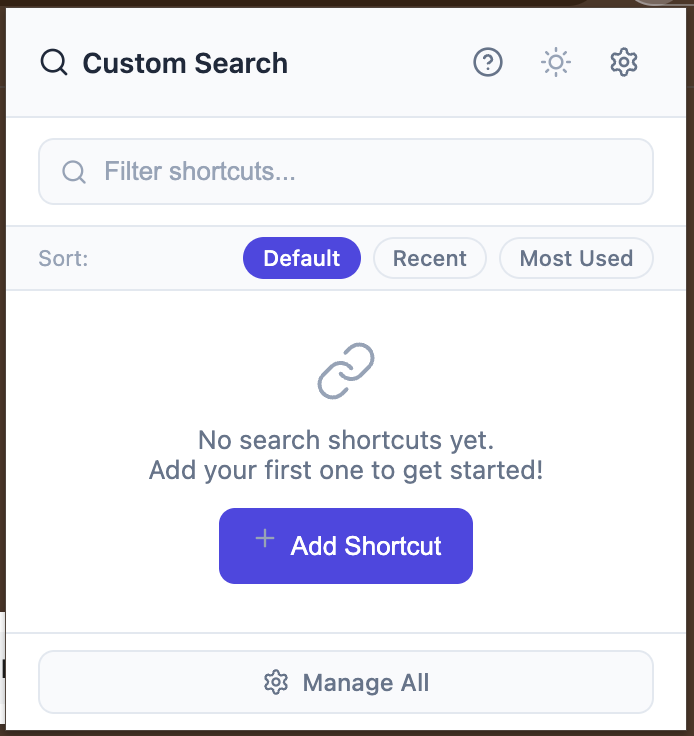
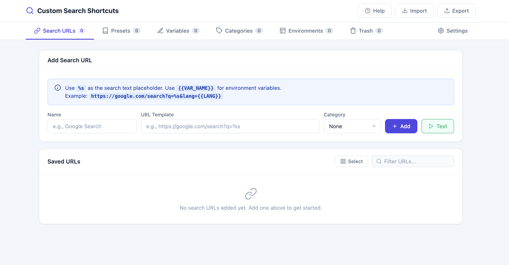
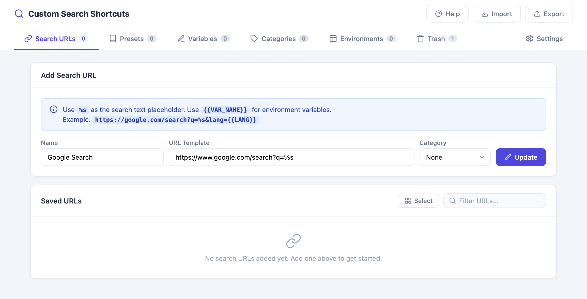
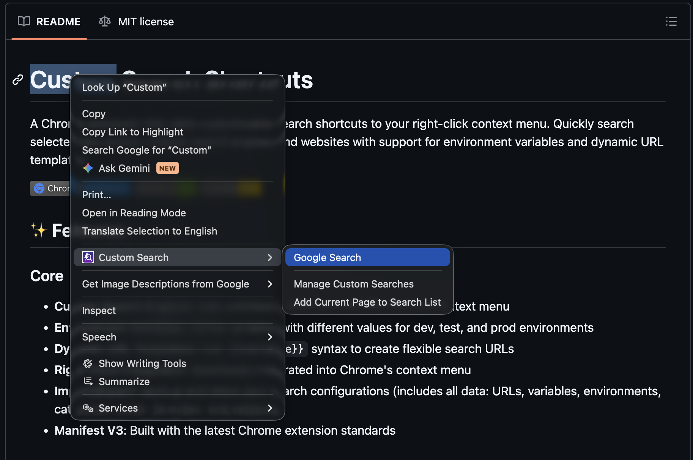

# Custom Search Engines

Add unlimited custom search shortcuts to your right-click context menu and search selected text on any webpage across any site you choose.

## How It Works

Every shortcut is a URL template. The extension replaces the `%s` placeholder in your URL with the text you select on a page (URL-encoded), then opens the result in a new tab.

## Step-by-Step

1. **Open the extension popup or Options page**
   - Click the extension icon in the toolbar, or
   - Right-click any page → **Manage Custom Searches**

   

2. **Go to the "Search URLs" tab** (default tab on the Options page)

   

3. **Add a new search URL**
   - Enter a **Name** (e.g., `Google Search`)
   - Enter a **URL** with `%s` as the search placeholder:
     ```
     https://www.google.com/search?q=%s
     ```
   - Optionally assign a **Category** (see [Categories](03-categories.md))
   - Click **Add URL**

   

4. **Use your search**
   - Select any text on a webpage
   - Right-click → **Custom Search** → choose your search engine
   - A new tab opens with your search results for the selected text

   

## Tips

- You can add as many search URLs as you like — there's no limit.
- If you paste a URL copied from an actual search results page, the extension can automatically suggest the correct `%s` placeholder (see [Smart URL Suggestions](09-productivity.md#smart-url-suggestions)).
- Use the ✏️ edit icon on a saved URL to update its name, URL, or category at any time.
- Use the 🗑️ delete icon to remove a shortcut — it goes to [Trash](10-safety-trash-and-undo.md) first, not permanently deleted.

## Related Features

- [Environment Variables & Dynamic URL Templates](02-environment-variables.md)
- [Categories](03-categories.md)
- [Favorites](06-favorites.md)
- [Keyboard Shortcuts](07-keyboard-shortcuts.md)
