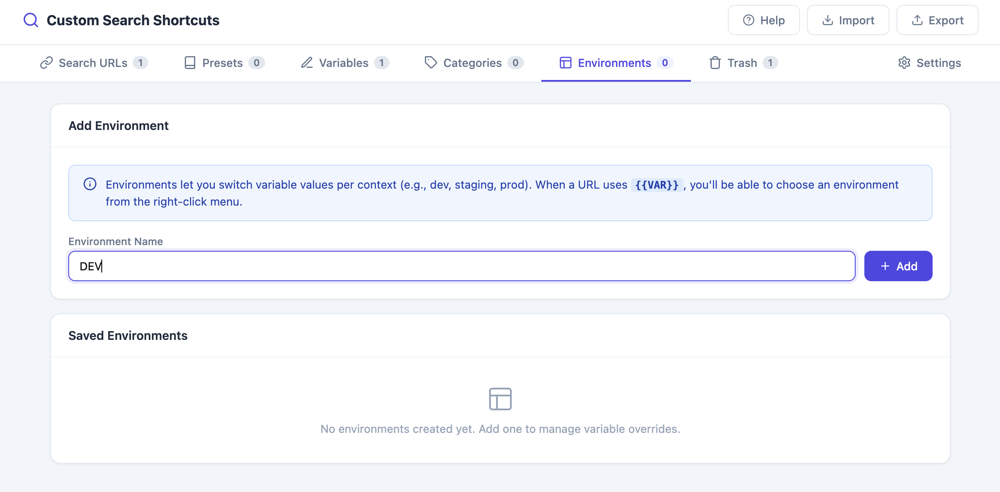
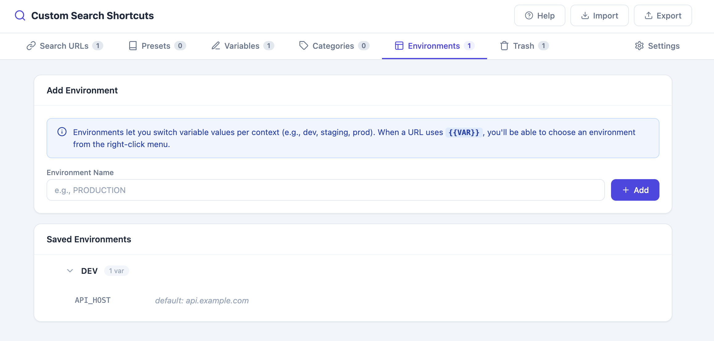
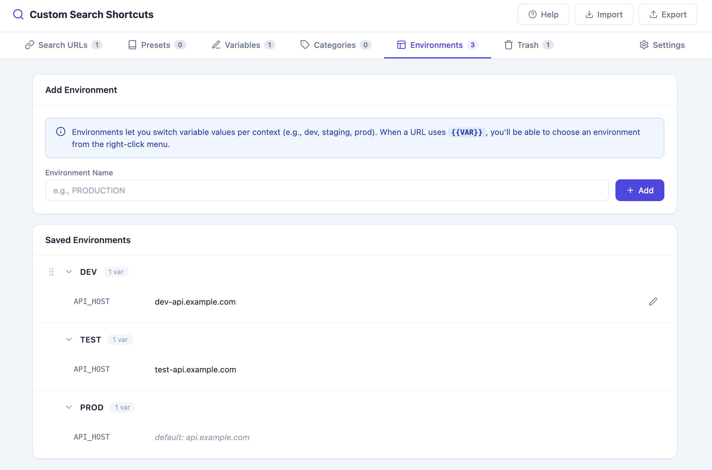
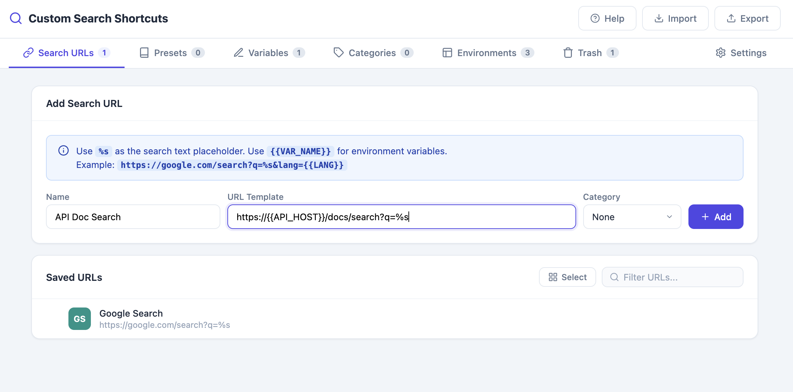
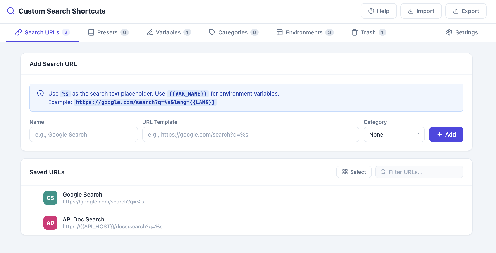
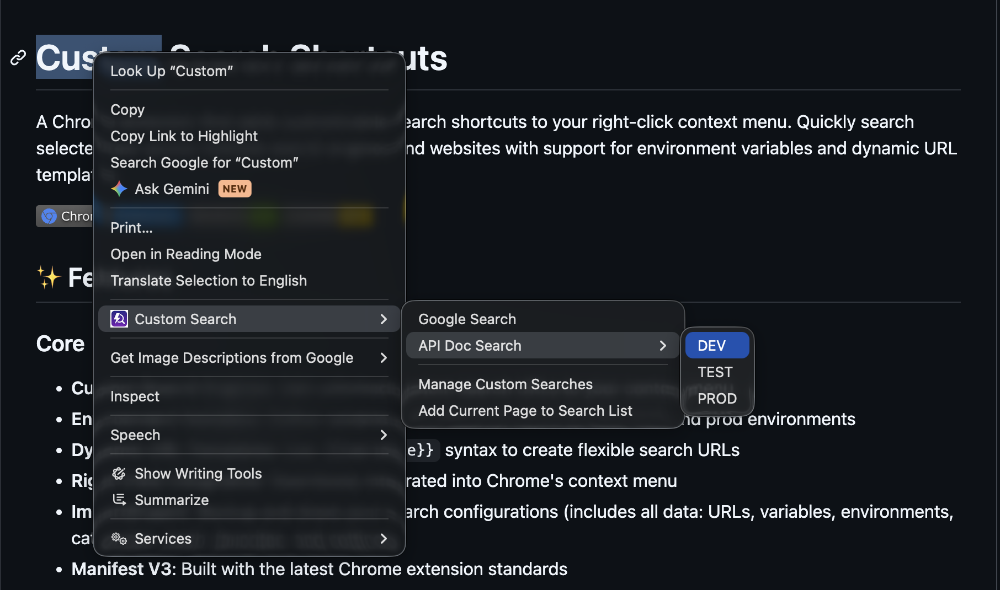

# Environment Variables & Dynamic URL Templates

Define variables with different values per environment (dev, test, prod) and use `{{variable}}` syntax inside your search URLs to build flexible, environment-aware search shortcuts. Perfect for developers who need to search the same tool across multiple environments.

## Example Use Case

Searching internal API documentation that is hosted at a different host per environment.

## Step-by-Step

### 1. Define a Variable

1. Go to **Options → Variables** tab
2. Enter a **Variable name** (e.g., `api_host`)
3. Enter a **Default value** (e.g., `api.example.com`)
4. Click **Add Variable**

   

### 2. Create Environments

1. Go to **Options → Environments** tab
2. Click **Add Environment** and give it a name (e.g., `Dev`)

   

3. Assign a value for each variable in this environment, or leave it blank to fall back to the variable's default value

   

   4. Repeat to add more environments (e.g., `Test`, `Prod`) — each with its own value for `api_host`

      

### 3. Create a Search URL That Uses the Variable

1. Go to **Options → Search URLs** tab
2. Enter a **Name** (e.g., `API Docs`)
3. Enter a **URL** using `{{variable}}` syntax combined with the `%s` search placeholder:
   ```
   https://{{api_host}}/docs/search?q=%s
   ```
4. Click **Add URL**

   

5. Review your final configuration across Variables, Environments, and URLs

   

### 4. Use an Environment-Specific Search

1. Select text on a webpage
2. Right-click → **Custom Search** → **API Docs** → choose an environment (**Dev** / **Test** / **Prod**)
3. The extension resolves `{{api_host}}` to the value defined for the chosen environment and opens the correct URL

   

## Notes

- If a variable has no value defined for a given environment, its **default value** is used instead.
- A URL with no variables behaves like a normal shortcut — no environment submenu is shown.
- A URL with one or more `{{variable}}` placeholders automatically gets an environment submenu in the context menu, listing every environment you've created.

## Related Features

- [Custom Search Engines](01-custom-search-engines.md)
- [Import/Export Configuration](12-import-export.md)
