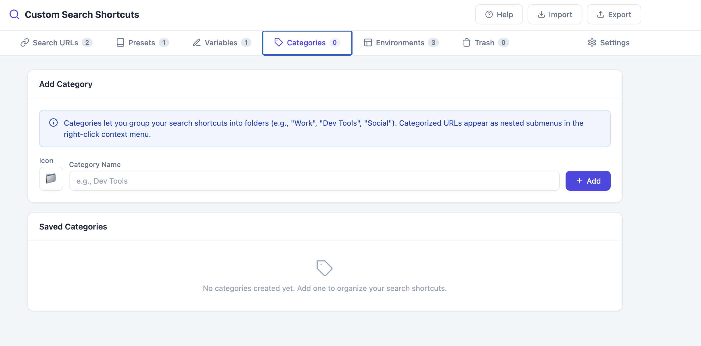
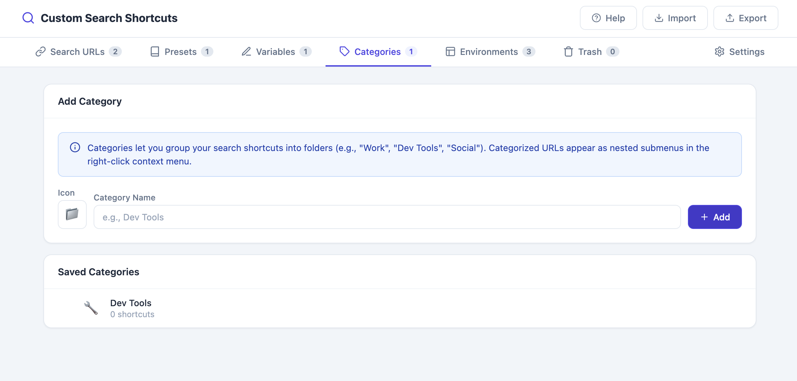
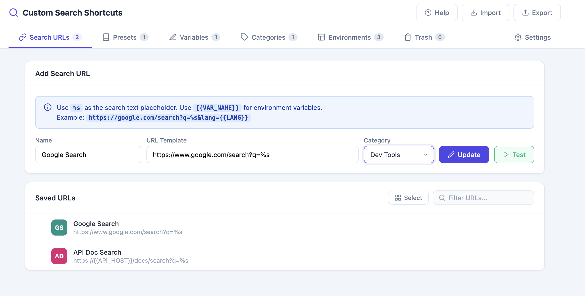
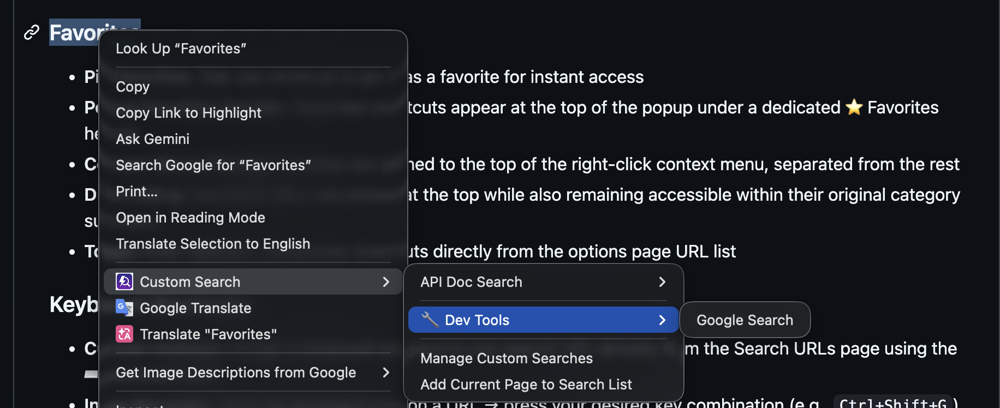
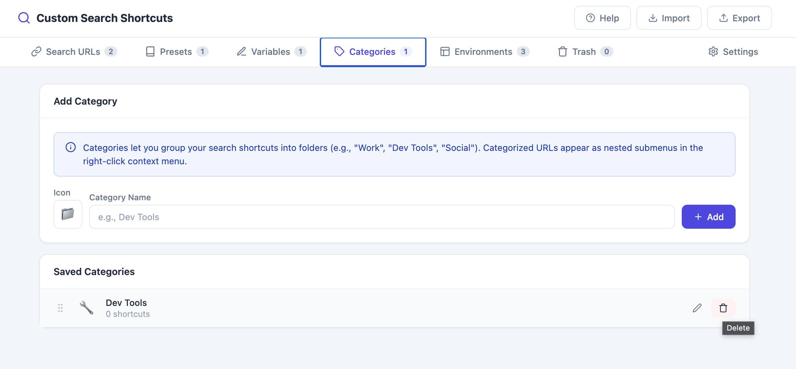

# Search Categories

Group your shortcuts into categories (e.g., "Work", "Dev Tools", "Social") that appear as nested submenus in the right-click context menu, and organize the popup/options views.

## Step-by-Step

1. Go to **Options → Categories** tab

   

2. **Add a new category**
   - Enter a **Name** (e.g., `Dev Tools`)
   - Pick an **emoji icon** for the category using the emoji picker
   - Click **Add Category**

   

3. **Assign a category to a shortcut**
   - Go to the **Search URLs** tab
   - When adding or editing a URL, choose a category from the dropdown

   

4. **See categories in action**
   - In the right-click context menu, shortcuts with a category are grouped under a nested submenu labeled with the category's emoji and name
   - In the popup, shortcuts are grouped under category headers with their emoji icons

   

5. **Reorder categories**
   - Drag and drop categories in the **Categories** tab to change their display order (see [Drag & Drop Reordering](04-drag-and-drop-reordering.md))

6. **Delete a category**
   - Click the 🗑️ icon next to a category 
   - Shortcuts that belonged to it become uncategorized (they still remain in your Search URLs list)

## Related Features

- [Custom Search Engines](01-custom-search-engines.md)
- [Drag & Drop Reordering](04-drag-and-drop-reordering.md)
- [Context Menu & Preset Customization](05-context-menu-customization.md)
