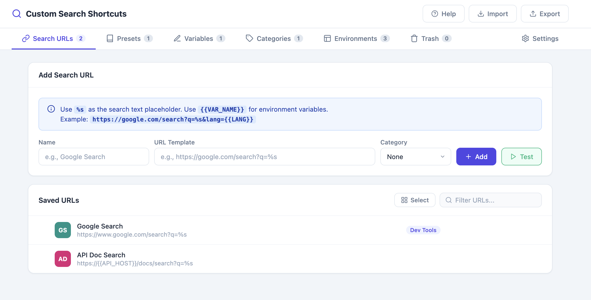
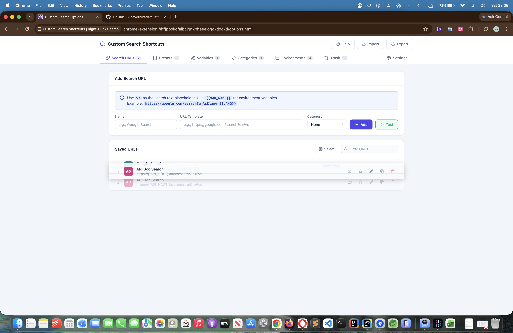
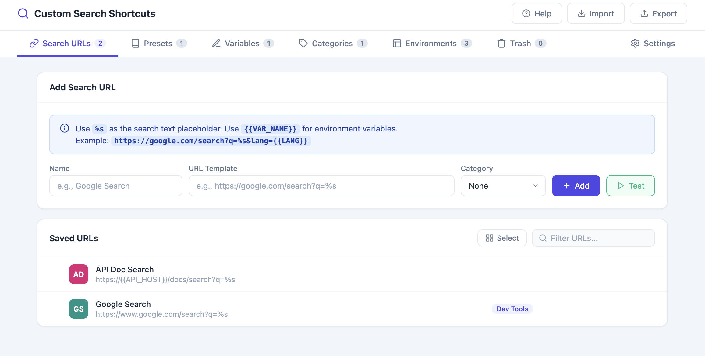

# Drag & Drop Reordering

Reorder URLs, categories, and environments by simply dragging them into the position you want — no separate "move up/down" buttons needed.

## Step-by-Step

1. Open the **Options** page and go to any list-based tab: **Search URLs**, **Categories**, or **Environments**

   

2. Click and hold the drag handle (or the row itself) on the item you want to move

   

3. Drag it up or down to the desired position in the list
4. Release to drop — the new order is saved automatically and immediately reflected in:
   - The right-click context menu
   - The extension popup

   

## Notes

- Reordering also works for the top-level context menu **sections** (Favorites, Presets, Custom URLs, Categories) — see [Context Menu & Preset Customization](05-context-menu-customization.md).
- The saved order persists across browser restarts and syncs via `chrome.storage.sync`.

## Related Features

- [Categories](03-categories.md)
- [Context Menu & Preset Customization](05-context-menu-customization.md)
