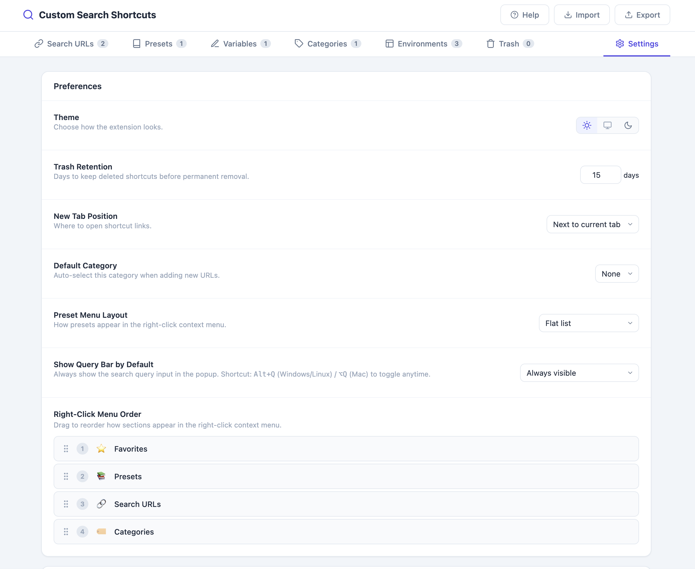
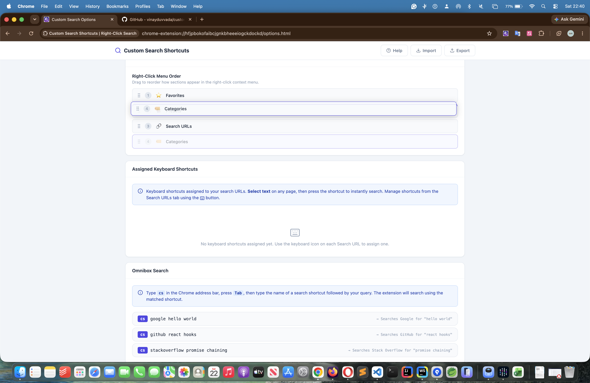
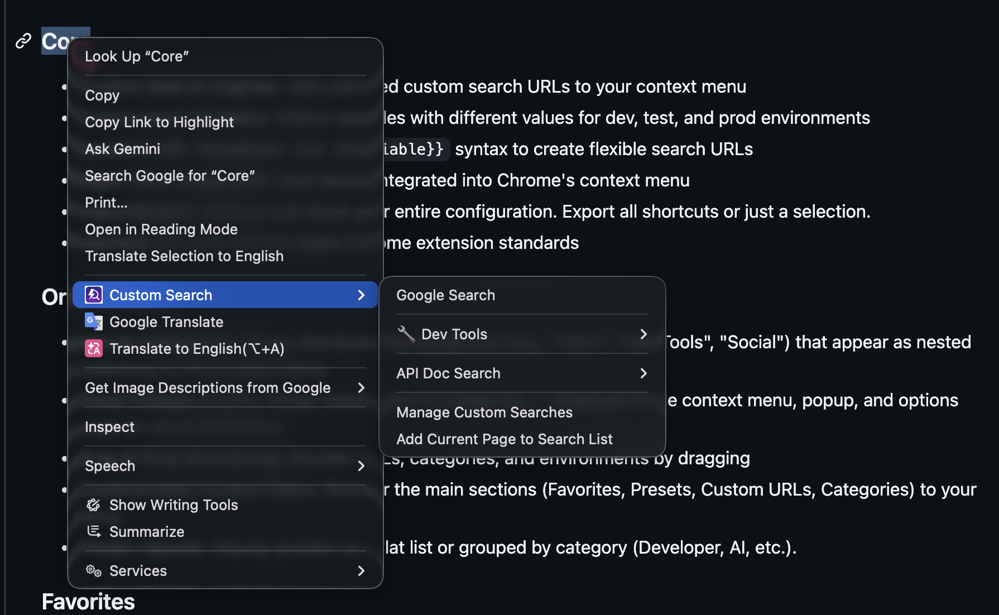
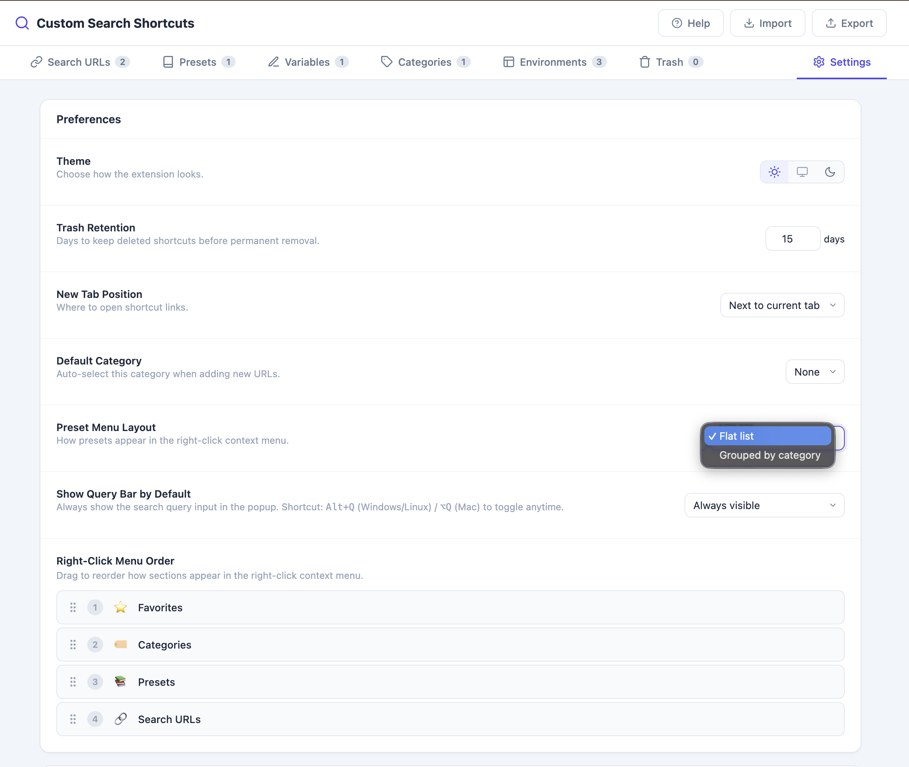
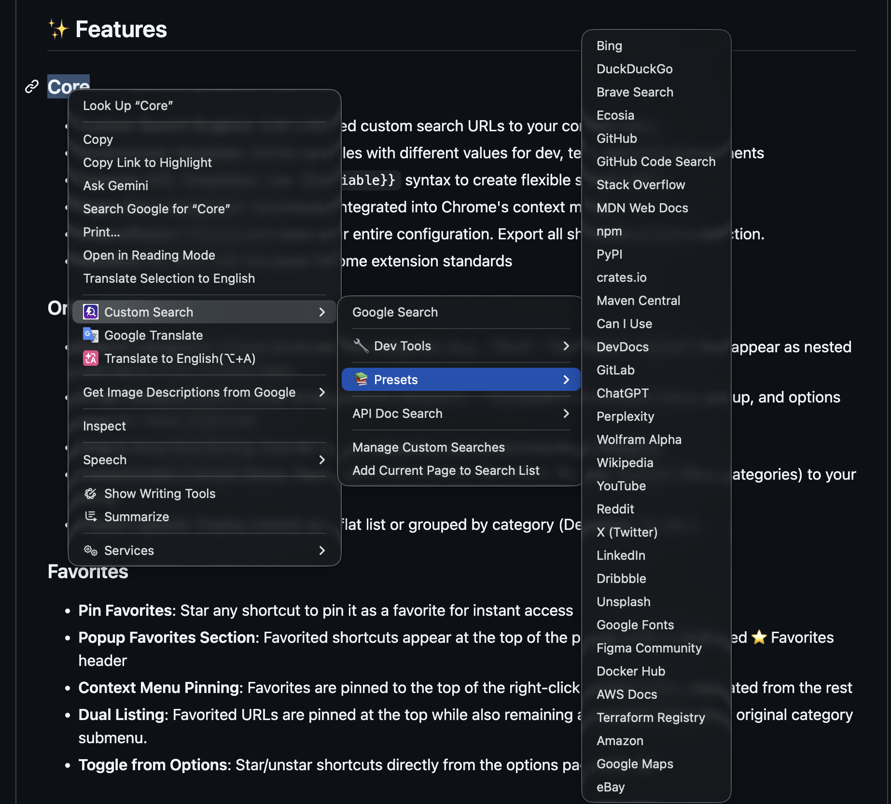
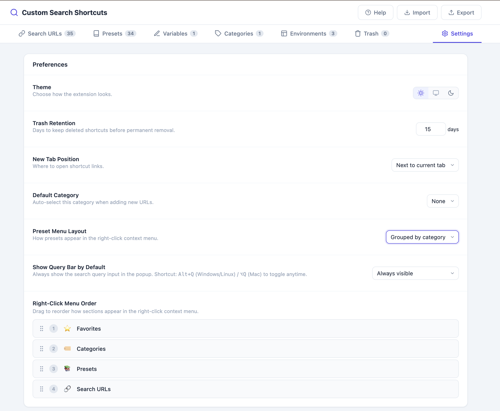
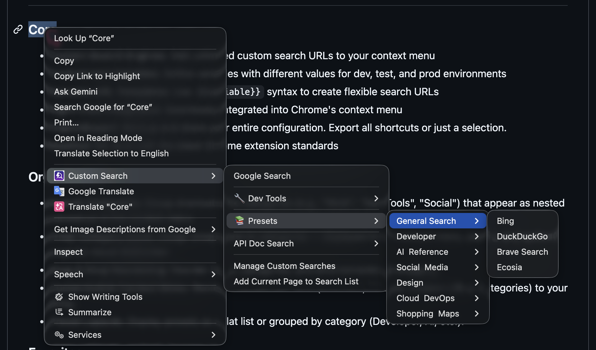
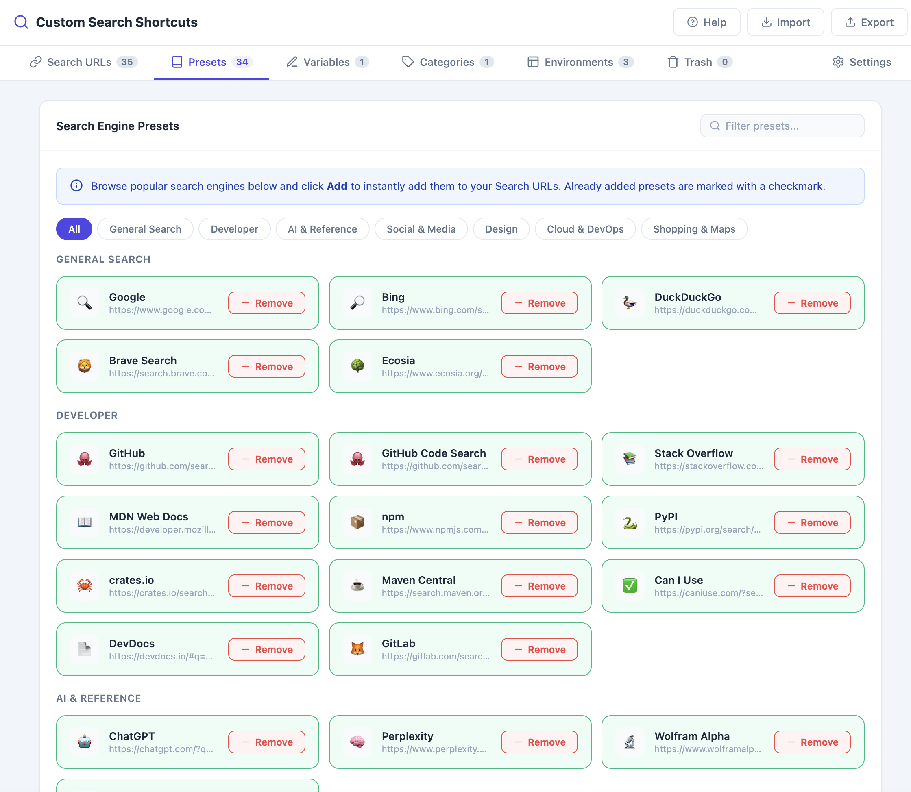

# Context Menu & Preset Customization

Control how the right-click context menu is organized: the order of its top-level sections, and whether built-in presets show as a flat list or grouped submenus.

## Step-by-Step

### Reorder Context Menu Sections

1. Go to **Options → Settings** tab (gear icon)

   

2. Find **Right-Click Menu Order**
3. Drag the section names (**Favorites**, **Presets**, **Custom URLs**, **Categories**) into your preferred order

   

4. Right-click any page to confirm the new section order in the context menu

   

### Choose Preset Layout

1. In **Options → Settings**, find **Preset Menu Layout**
2. Choose:
   - **Flat list** — all presets appear directly in the Presets menu
   
   - Right-click a page and open **Custom Search → Presets** to see the Flat list layout
   
   - **Grouped submenus** — presets are grouped by type (e.g., Developer, AI) into nested submenus
   
   - Right-click a page and open **Custom Search → Presets** to see the Grouped submenus layout
   

### Browse Built-in Presets

1. Go to **Options → Presets** tab to see all available built-in search engine presets
2. Click **Add** on any preset to add it directly to your Search URLs list

   

## Related Features

- [Categories](03-categories.md)
- [Drag & Drop Reordering](04-drag-and-drop-reordering.md)
- [Favorites](06-favorites.md)
