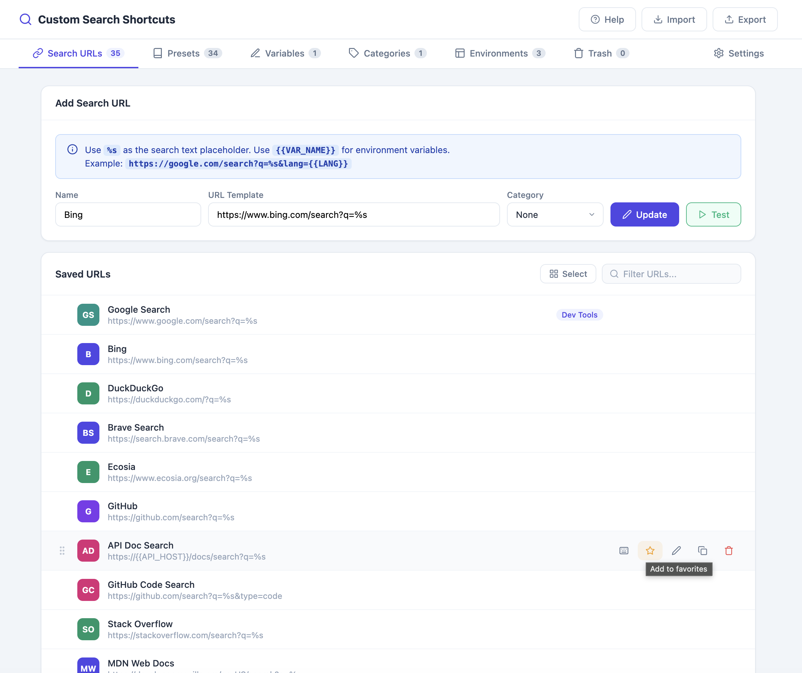
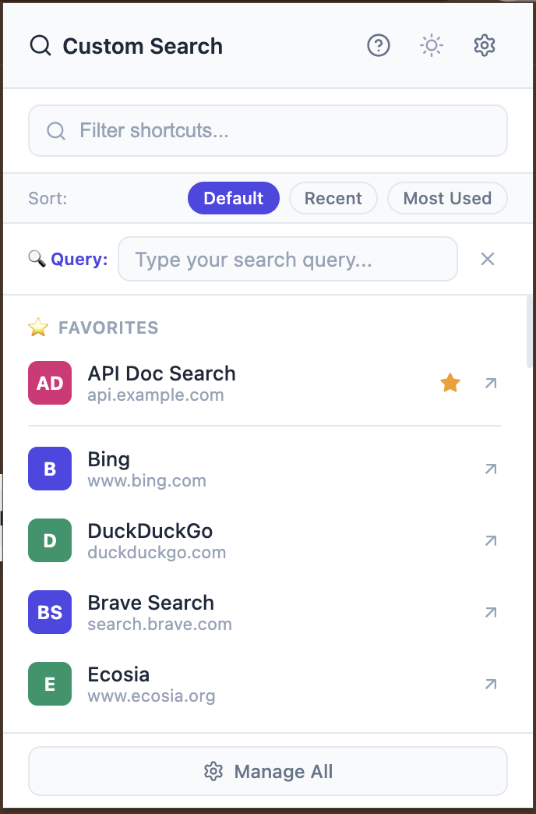
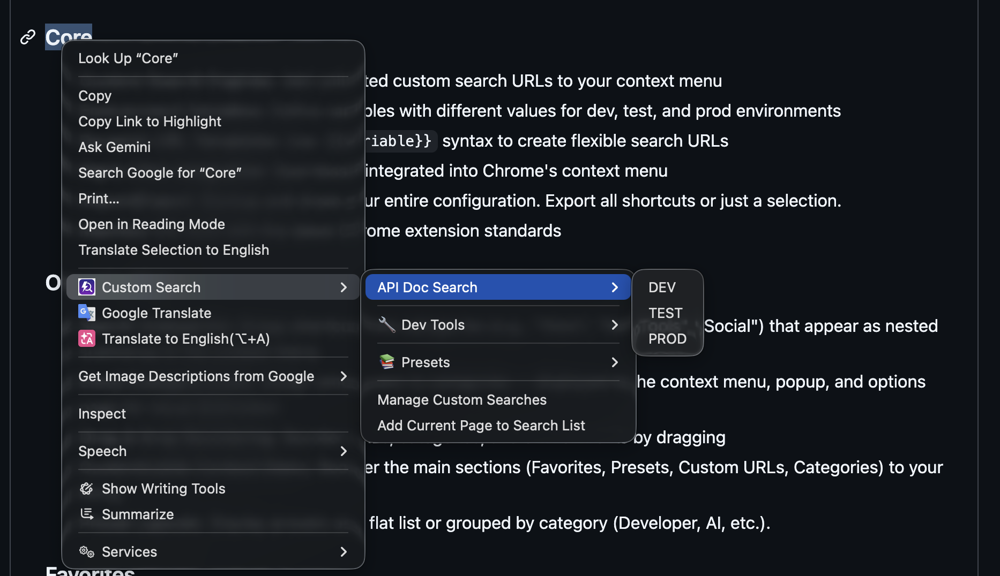

# Favorites

Star any shortcut to pin it for instant access at the top of both the popup and the right-click context menu.

## Step-by-Step

1. **Star a shortcut from the Options page**
   - Go to **Options → Search URLs**
   - Click the ⭐ icon next to any saved URL to mark it as a favorite (it turns solid/filled)

   

2. **Star a shortcut from the popup**
   - Open the extension popup
   - Click the ⭐ icon next to any shortcut in the list

   

3. **See favorites in the popup**
   - Favorited shortcuts appear at the top of the popup under a dedicated **⭐ Favorites** header, above all other sections

   

4. **See favorites in the context menu**
   - Right-click any page → **Custom Search**
   - Favorited shortcuts are pinned at the top, separated from the rest by a divider
   - If a favorited shortcut also belongs to a category, it still appears inside that category's submenu too (dual listing)

   

5. **Unstar** — click the same ⭐ icon again (from either the popup or Options page) to remove it from Favorites

## Related Features

- [Custom Search Engines](01-custom-search-engines.md)
- [Context Menu & Preset Customization](05-context-menu-customization.md)
