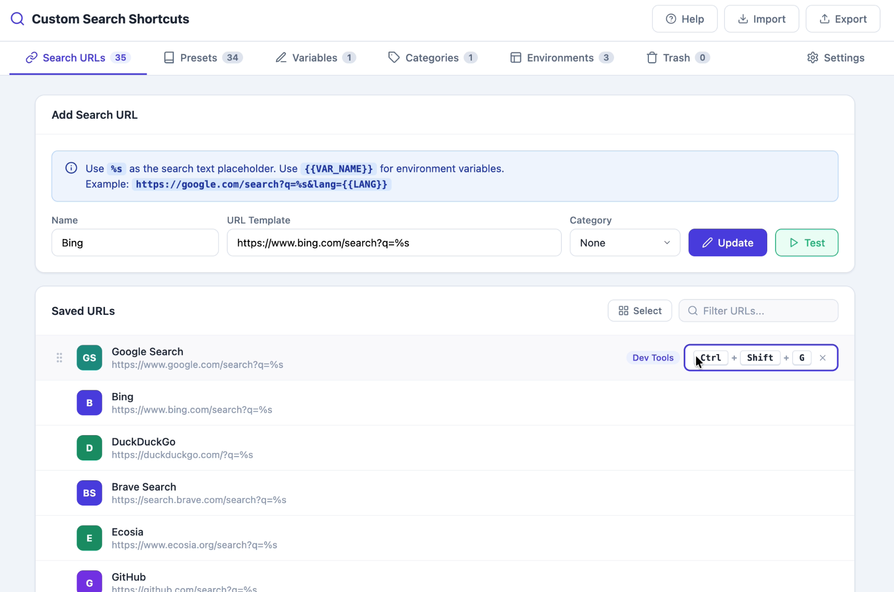
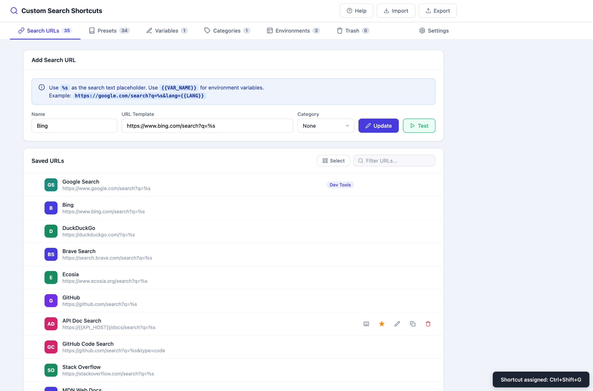
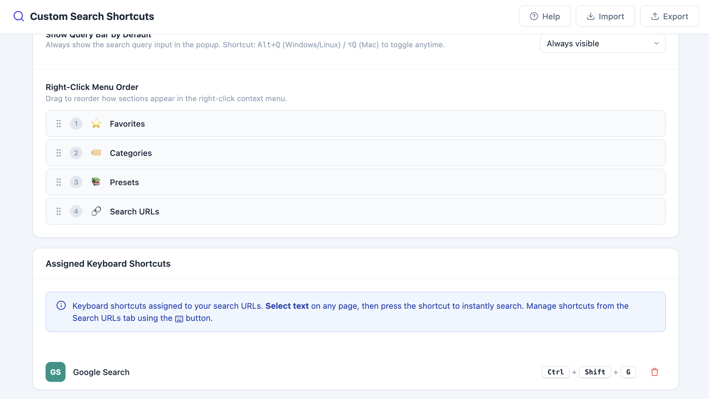
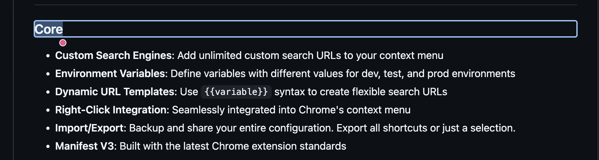
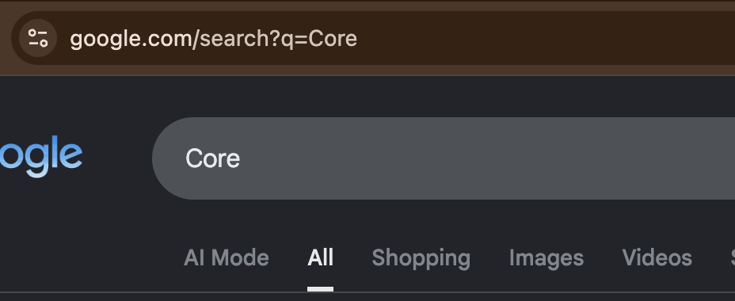

# Keyboard Shortcuts

Assign a custom hotkey to any search URL so you can select text on any page and instantly trigger that search without touching the mouse or the context menu.

## Step-by-Step

1. Go to **Options → Search URLs** tab

2. Click the ⌨️ **keyboard icon** on the URL you want to assign a shortcut to

   

3. **Record the shortcut**
   - The icon enters "recording" mode
   - Press your desired key combination, e.g. `Ctrl+Shift+G`
   - Modifier keys are shown live as you hold them, and the full combo is displayed before saving

   

4. The shortcut is **saved instantly** once a valid combination (including at least one modifier: `Ctrl`, `Alt`, or `Shift`) is pressed

   

5. **Use the shortcut**
   - Select text on any webpage
   - Press the assigned key combination
   - The search opens instantly, just like using the context menu

   

6. **Remove a shortcut**
   - Click the keyboard icon to enter recording mode again
   - Press `Backspace` or `Delete` to remove the existing shortcut

7. **View all assigned shortcuts**
   - Go to **Options → Settings → Assigned Keyboard Shortcuts** to see and manage every shortcut you've configured

   

## Notes

- A small purple dot badge appears on the keyboard icon for any URL that already has a shortcut assigned.
- Shortcuts require at least one modifier key — plain letter keys alone are not accepted, to avoid conflicting with normal typing.

## Related Features

- [Custom Search Engines](01-custom-search-engines.md)
- [Omnibox Search](08-omnibox-search.md)
