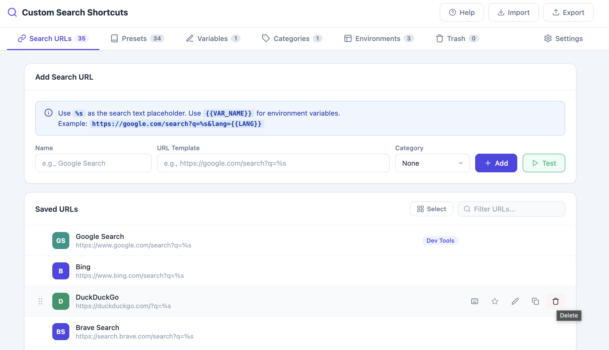
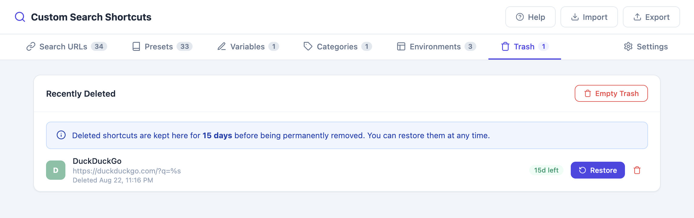
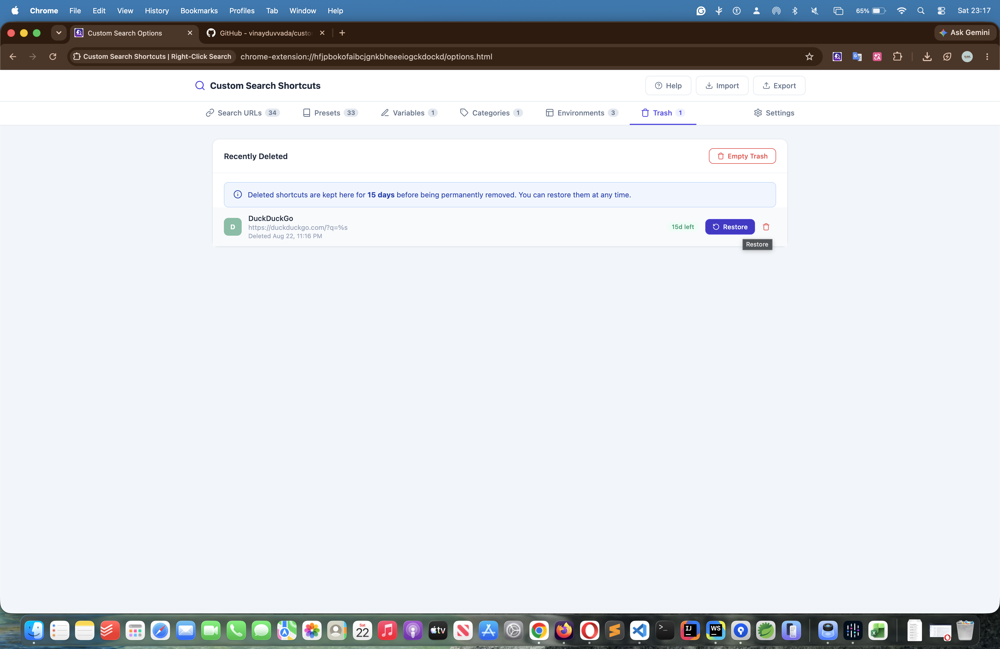
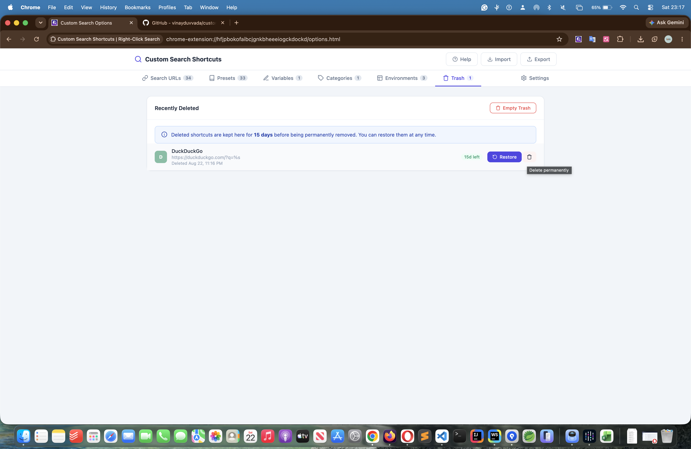
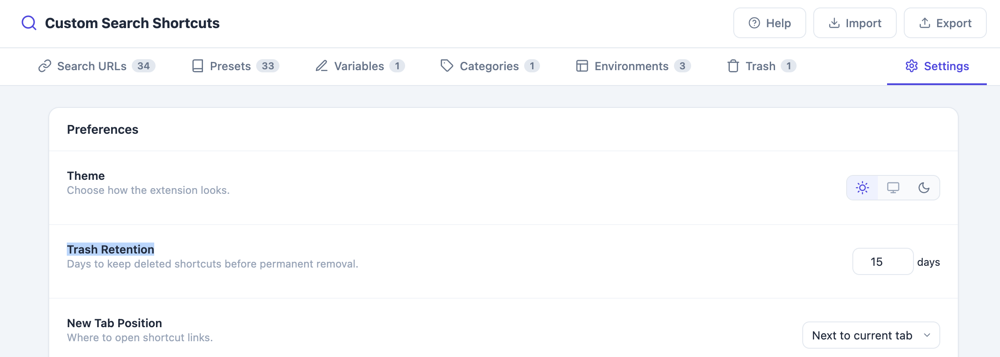

# Safety: Trash & Undo Delete

Deleted shortcuts aren't gone immediately — they move to a Trash with a Gmail-style "Undo" toast, so mistakes are easy to recover from.

## Step-by-Step

### Deleting a Shortcut

1. Go to **Options → Search URLs**
2. Click the 🗑️ delete icon on the shortcut you want to remove
3. A toast notification appears at the bottom: **"Deleted [name]" — Undo**

   

4. Click **Undo** within the toast's visible window to restore it immediately, or let it dismiss to send the item to Trash

### Viewing and Restoring from Trash

1. Go to **Options → Trash** tab

   

2. Click **Restore** on any item to bring it back to your active Search URLs list

   

3. Click **Delete Permanently** on an item to remove it for good, or **Empty Trash** to permanently clear everything at once

   

### Configuring Trash Retention

1. Go to **Options → Settings → Trash Retention**
2. Set the number of days (1–90) to keep deleted items before they are automatically and permanently removed

   

## Related Features

- [Custom Search Engines](01-custom-search-engines.md)
- [Productivity Features](12-productivity.md)
